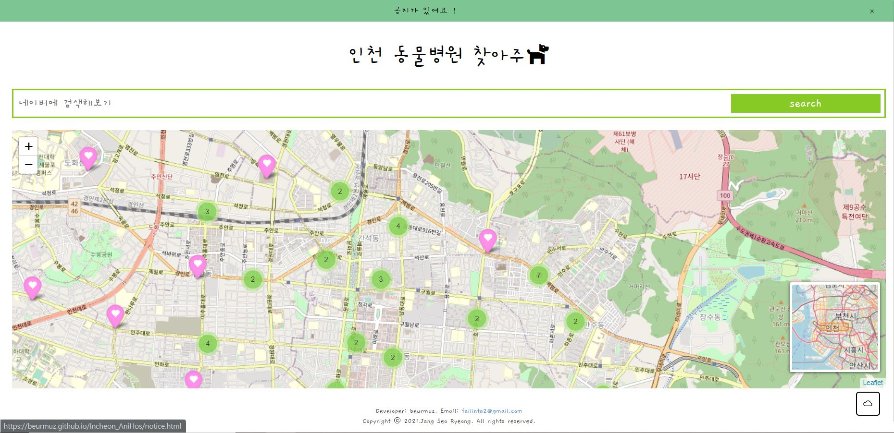
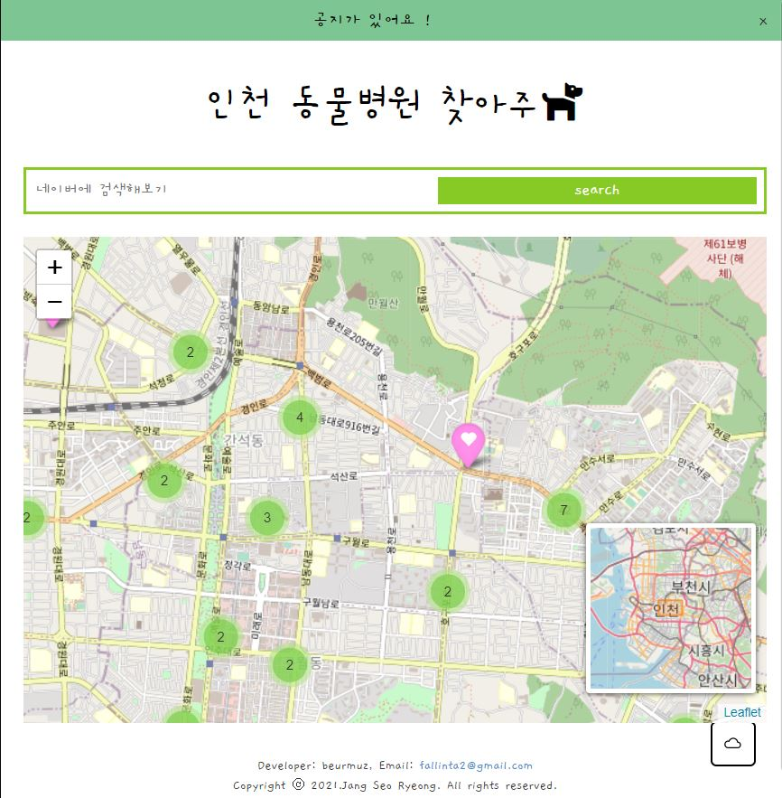
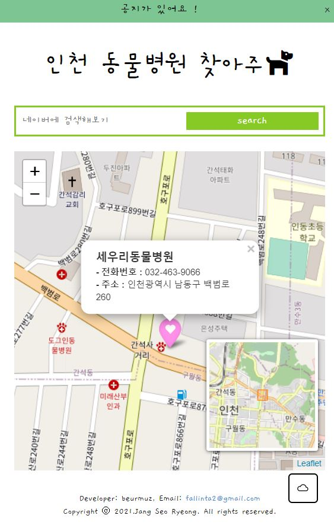
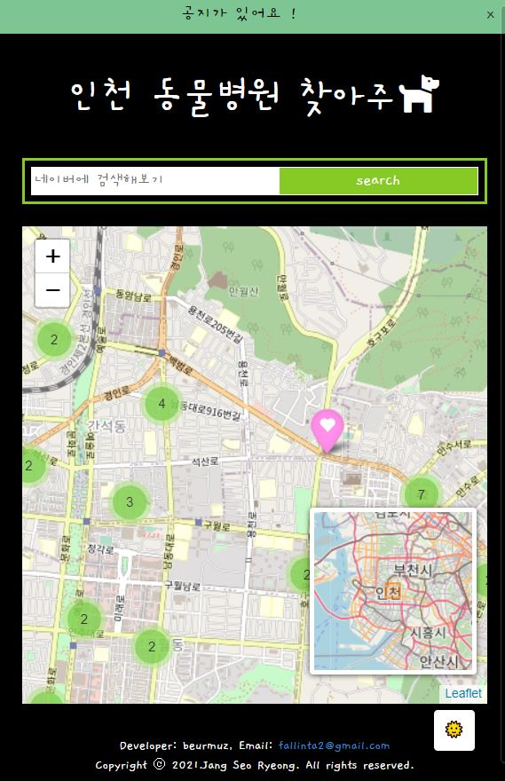

## 🐕 Incheon_AniHos
### 소개
- [인천 동물병원 찾아주개](https://beurmuz.github.io/Incheon_AniHos/)는 인천광역시 내에 있는 동물 병원 현황을 확인할 수 있는 사이트 입니다. 

<!-- ### 🤔 개발하게 된 동기?
- 해당 사이트를 제작하게 된 이유는, 인천시 동물 병원에 대한 정보를 한눈에 확인할 수 있게하기 위함이었습니다.
- Python 튜터링을 진행하던 중 Folium이란 라이브러리에 대해 알게 되었고, 이를 활용하면 병원에 대한 간략한 정보를 제공할 수 있으리라 생각했습니다.
- 본래 주차 여부나 운영시간까지도 표현하고 싶었으나 **공공데이터 포털**에서 구마다 제공하는 정보가 달라 이용하지 못했습니다. 
 -->
### 개발 기간
- 2021.09.25, 10.18

### 사용한 기술 스택 
- HTML
- SCSS
- JavaScript
- Python
- Folium

 

## 사이트 살펴보기
- 메인화면
  - 단일 페이지로, css의 **미디어 쿼리**를 활용하여 반응형으로 제작
  

    

- 기능
  1. 지도 zoom in-out을 통해 병원의 주소와 전화번호 정보를 얻을 수 있음
   
   

  2. ☁과 🌞버튼을 통한 배경색 전환
   
   

 

## 🔧 추후 기능 개선 예정
- 검색란에 병원 검색 시, 지도에서 바로 보여줄 수 있게끔 개선할 예정
- folium사용이 아닌 구글이나 네이버 지도 API를 적용해볼 예정 
- 새로운 병원 정보가 업데이트 될 시, 자동으로 적용될 수 있도록 할 예정

